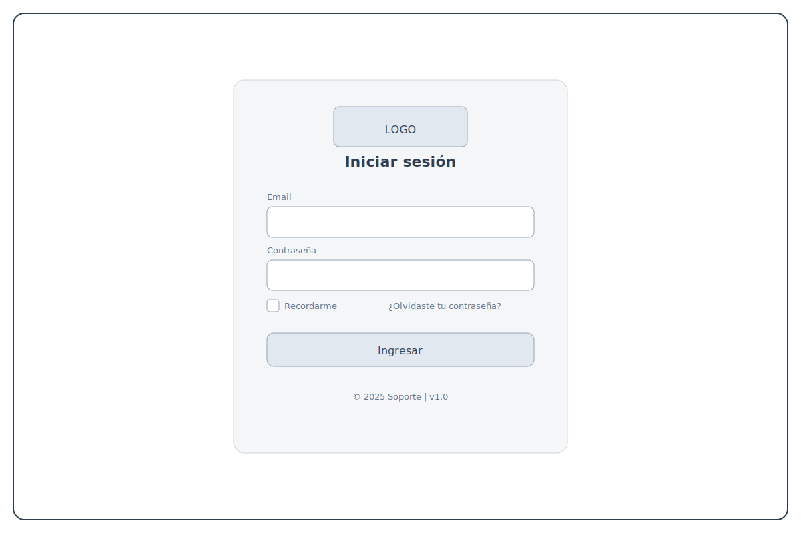
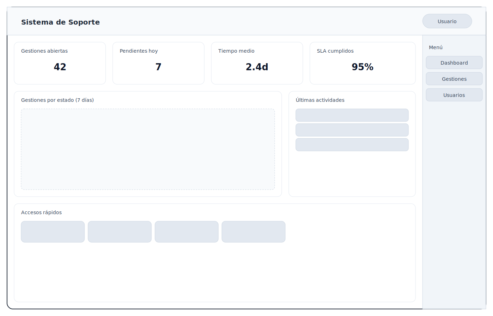
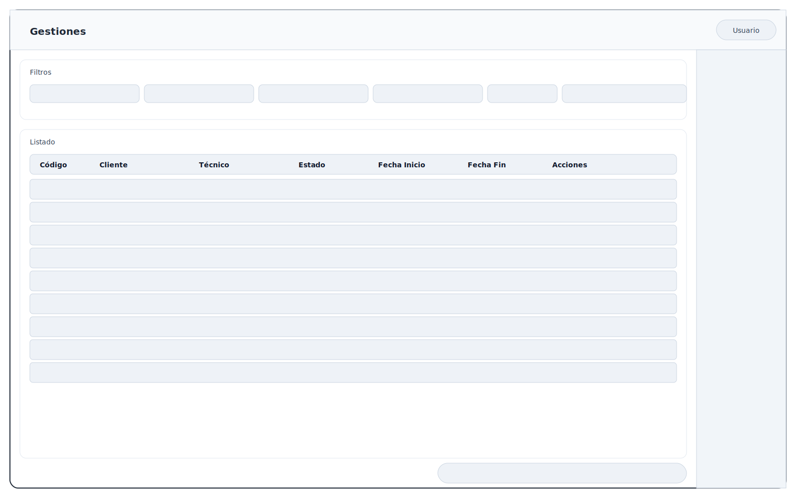
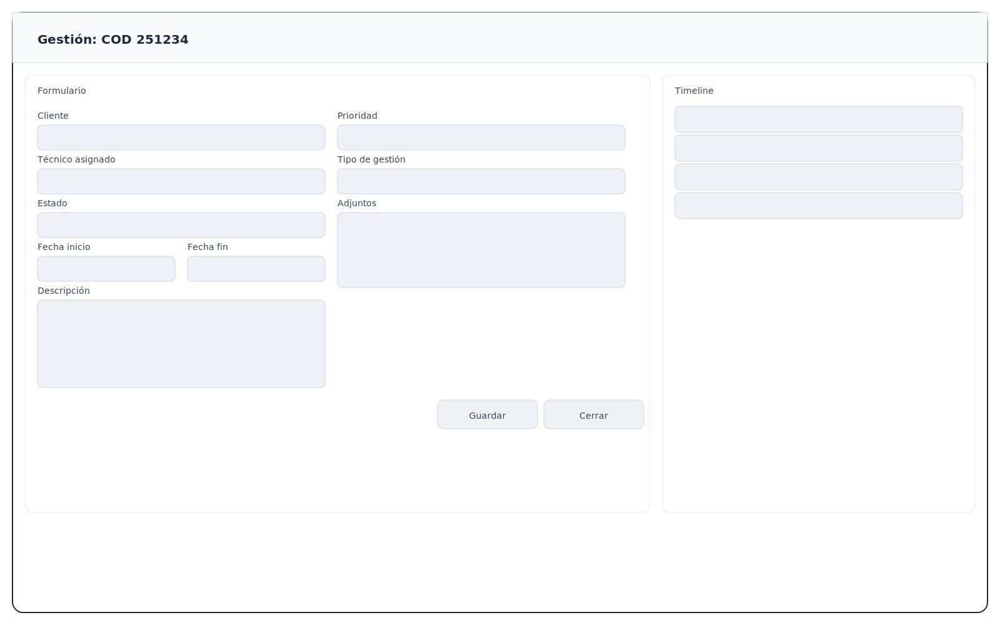
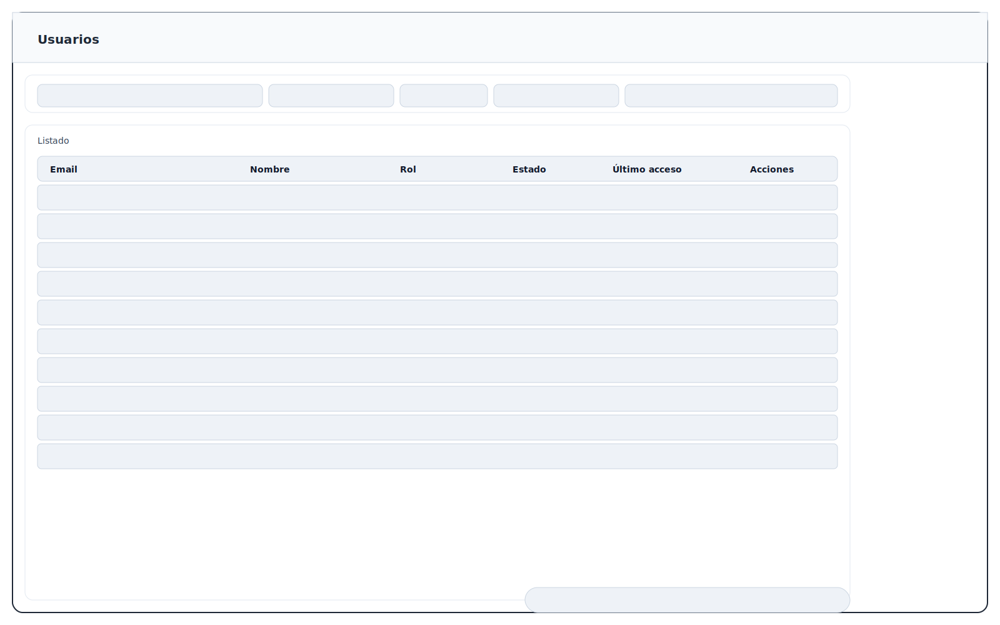

# Sistema de Soporte (Angular)

SPA base con módulos de Seguridad y Gestión. Incluye rutas, layout (header + menú lateral derecho + footer), páginas base y environments.

## Requisitos

- Node 20+
- npm 9+

## Instalación

1. npm install
2. npm start (abre en http://localhost:4200)

## Estructura

- src/app/pages/public: Home pública (login/registro)
- src/app/pages/auth: Login
- src/app/pages/dashboard: Layout autenticado (menu lateral derecho) + bienvenida
- src/app/modules/gestion: Gestiones, Tipos de gestión, Empleados, Tipos de empleado
- src/app/modules/seguridad: Usuarios, Roles
- src/app/environments: environment.ts / environment.prod.ts

## Mockups (Wireframes)

Los siguientes mockups ilustran el diseño inicial de las pantallas principales. Se encuentran en `docs/mockups/`:

- Login: `docs/mockups/login.svg`
- Dashboard: `docs/mockups/dashboard.svg`
- Gestiones (Lista): `docs/mockups/gestiones-list.svg`
- Gestión (Detalle): `docs/mockups/gestion-detail.svg`
- Usuarios (Lista): `docs/mockups/usuarios-list.svg`

Vista rápida:

## Próximos pasos

- Integrar AuthService con /api/auth/login y guardar token
- Implementar guards por rol y menú dinámico
- Crear componentes reutilizables (tabla, modal, menú contextual)
- Conectar a endpoints del gateway para CRUD

## Notas sobre Gestiones (UI)

- La lista y el detalle de Gestiones muestran el campo `Codigo` (YYNNNN), de solo lectura, provisto por el backend al crear la gestión.
